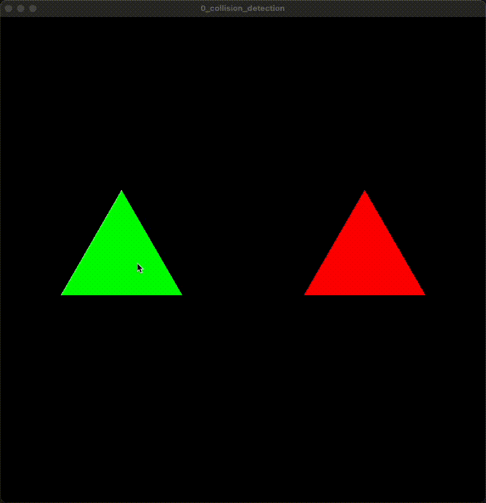
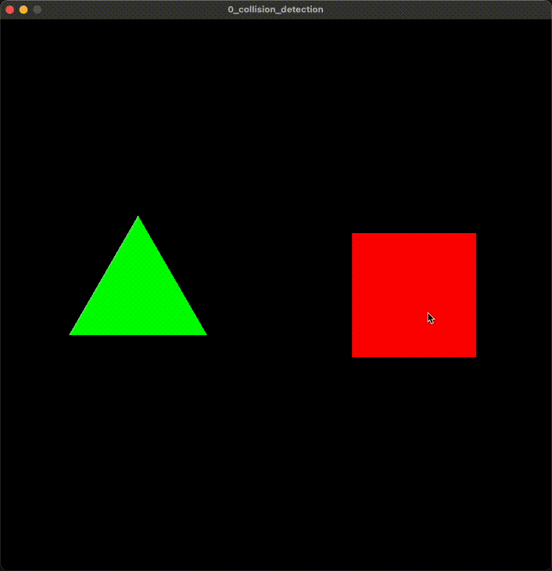
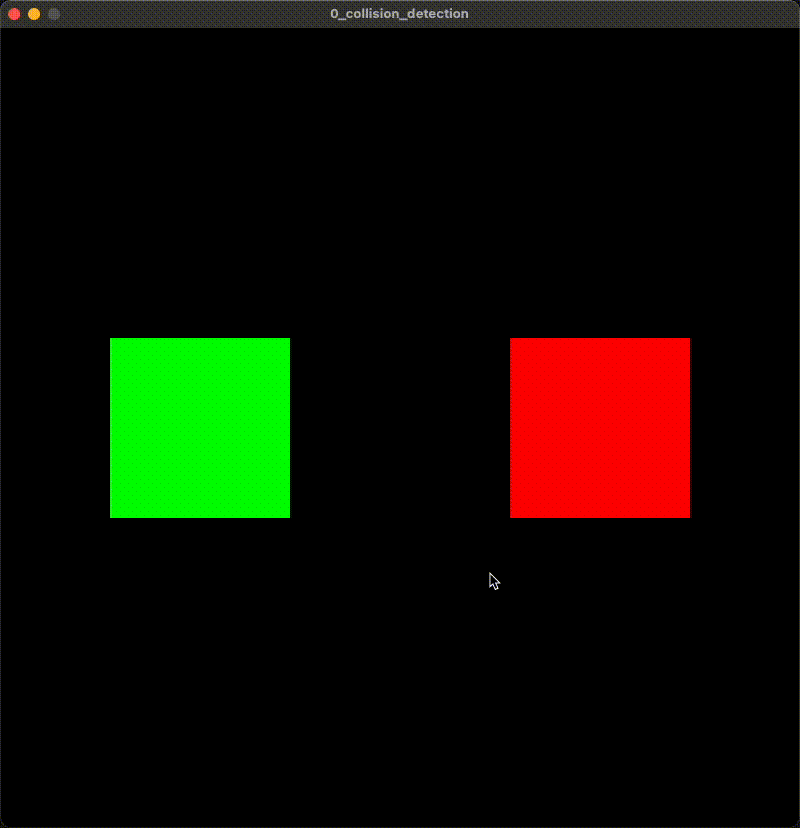

# Collision Detection
This example showcases the collision detection algortihm SAT. It displays two shapes which
 the user can drag into each other to visualize the collision point, visualized as a
  yellow rectangle.

  

## Dependencies
Requires that Vulkan is installed on the system and appropriate changes are done to the `CMakeLists.txt` file.
## Instructions
Build and run the example from the root directory using:
````
$ ./build.sh
$ ./build/bin/0_collision_detection
````

- Click and drag any of the selected shapes
- Press T to toggle between different shape types
- Press R while a shape is selected to rotate

## Improvements 
- The current implementation of SAT assumes that all collisions are vertex to vertex. This causes some unrealistic responses when resolving the collision. An improvement is to also determine the type of collision (vertex-vertex, edge-vertex or edge-edge) and create an approproate response calculation.