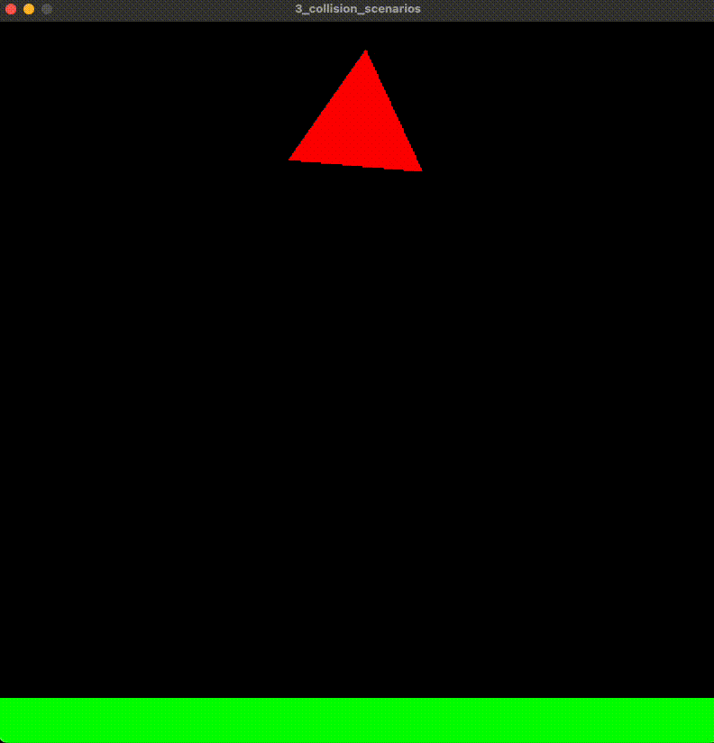

# Collision Scenarios 
This example is a playground for different collision scenarios to test the correctness of the collision system.



## Dependencies
Requires that Vulkan is installed on the system and appropriate changes are done to the `CMakeLists.txt` file.
## Instructions
Build and run the example from the root directory using:
````
$ ./build.sh
$ ./build/bin/3_collision_scenarios
````
